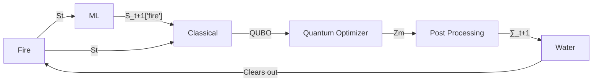

# QuRAWC: Quantum Realtime Algorithm for Wildfire Containment <!-- omit from toc -->


This repository contains **QuRAWC**, a cutting-edge model developed to address wildfire containment using quantum
computing principles. This project is part of **The Blaise Pascal Quantum Challenge** aimed at achieving the United
Nations Sustainable Development Goals (SDGs) **13 (Climate Action)** and **15 (Life on Land)**.

# Table of Contents <!-- omit from toc -->

- [Overview](#overview)
  - [Project Structure](#project-structure)
  - [Problem Statement](#problem-statement)
  - [Solution Approach](#solution-approach)
- [Installation/Setup](#installationsetup)
  - [If you are looking to contribute](#if-you-are-looking-to-contribute)
- [Data Sources](#data-sources)
- [Objectives](#objectives)
- [Features](#features)

# Overview

Wildfires are a growing global challenge, with devastating impacts on ecosystems, biodiversity, and human life. **QuRAWC** leverages quantum algorithms to provide real-time decision-making solutions for wildfire containment and prevention.
By harnessing quantum computational advancements, our goal is to predict wildfire behavior and optimize containment
strategies effectively.

## Project Structure

1. /docs:

- Thematic methodology documentation (AI models, quantum circuits,
  optimization process).
- Bibliographic references (if any)

2. /data:

- Source dataset (sample, synthesized or original)
- Pre-processing, pruning or any other applied initial data treatment

3. /code

- Python scripts in a well separated source folder
- Any necessary dependencies.
- Modularity and organization for ease of navigation.

4. /test

- Example test cases
- Jupyter Notebooks to present said examples (MWE)

5. /results

- Obtained outputs and comparison.
- Benchmarks and performance analysis
- Logs

## Problem Statement

Design a realtime algorithm that optimally allocates wildfire firefighting resources with the aim of containing wildfire spread by taking into account the realtime meteorological and geographical conditions on the field.

Keyword definitions mentioned in the problem statement:

- Realtime algorithm: the algorithm needs to automatically run in real time, without the need for constant human supervision and intervention.
- Optimally allocates firefighting resources: the algorithm needs to make sure that the firefighting resources (in terms of tools and personnel) are deployed in an optimal manner, taking both resource constraints and safety into consideration.
- With the aim of containing wildfire spread: the algorithm’s main purpose is to contain the wildfire; it is undoubtedly good if the algorithm can also provide the strategy for completely putting the fire out, but this is not its main objective.
- Meteorological and geographical conditions: the algorithm needs to take into account these aspects as well, for example the elevation of the terrain, the wind speed and direction, the vegetation on the ground etc.

## Solution Approach

Our algorithm needs to answer the question of where should a firefighting organization deploy firefighters in the next time step in order to contain the fire in the most effective way.

When a wildfire (`Fire`) combusts we are able to map the current perimeters of the fire and predict its' spread (evolution) using our Conv-LSTM model (`ML`).

After getting the next state of the fire we need to figure out how to efficiently extinguish it. & .

This is where QUBO (`Classical`) - Quadratic Unconstrained Binary Optimization and QAA - Quantum Adiabatic Algorithm (`Quantum Optimizer`) come in.
QUBO is a combinatorial optimization NP-hard problem. It uses the current and predicted state to create a matrix which encodes the optimal strategy. This strategy can them be solved as QAA problem on a quantum computer, i.e. we are trying to find the global minimum of a function.

QAA provides a minimized bitstring as an output. This output is processed (`Post Processing`) and as a result we get a readable optimal strategy. We can use our available resources (`Water`) to then deal with the fire.

This loop is repeated until the fire is quenched.



where

- St -> State of fire at a given time
- QUBO -> Quadratic unconstrained binary optimization
- Zm -> Minimized bitstring
- ∑_t -> Strategy for fire extinction at a given time

# Installation/Setup

1. Clone this repository:
   ```sh
   git clone https://github.com/<username>/qurawc.git
   ```
2. Install the required dependencies:
   ```sh
   poetry lock
   poetry install
   ```

If you do not have poetry installed follow these instructions:

> https://python-poetry.org/docs/#installation

## If you are looking to contribute

1. Set up pre-commit which ensures consistency and good practice
   ```sh
   poetry shell
   pre-commit install
   ```

# Data Sources

[WildfireSpreadTS: A dataset of multi-modal time series for wildfire spread prediction](https://zenodo.org/records/8006177) is a multi-temporal, multi-modal remote-sensing dataset for predicting how active wildfires will spread.
It consists of 13.607 images across 607 fire events in the United States from January 2018 to October 2021.

This dataset is created using Google Earth Engine. The code for recreating the dateset is open source and avaialbe [here](https://github.com/SebastianGer/WildfireSpreadTSCreateDataset)

&copy; DataSpread TS dataset is under The Creative Commons Attribution license.

# Objectives

- Develop and apply quantum-assisted algorithms for wildfire modeling and containment.
- Contribute to innovation in climate action (UN SDG 13) and sustainable development for terrestrial ecosystems (UN SDG
  15).
- Provide accurate, real-time predictions to minimize the destructive impact of wildfires and enable rapid response
  strategies.

# Features

- **Quantum Optimization**: Applies quantum computing paradigms to compute optimal fire containment paths.
- **Real-Time Modelling**: Processes real-time data inputs to simulate and predict wildfire behavior.
- **Scalability**: Designed to scale across diverse landscapes and wildfire scenarios.
